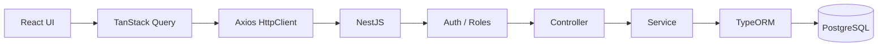

# Architecture

## Monorepo

```
e-commerce-site/
├── apps/web          # Vite + React storefront & admin
├── apps/api          # NestJS API
├── packages/contracts # Shared enums, DTOs, return types
└── docs/
```

Both apps depend on `@repo/contracts` so API responses and UI types stay aligned.

## Request flow



1. UI hooks call `apps/web/src/api/services/*`.
2. Axios attaches `Authorization: Bearer <accessToken>` and expects `{ success, data, message }`.
3. Nest validates DTOs, runs guards, then services mutate/query Postgres.
4. Global interceptor wraps successful responses; exception filter formats errors.

## API modules

| Module | Owns |
|--------|------|
| `auth` / `users` | Sign-up, sign-in, sign-out, profile, JWT |
| `product-categories` | Category CRUD |
| `products` | Product CRUD |
| `product-variants` | Variant CRUD, stock fields |
| `carts` | Active cart, line items |
| `addresses` | User shipping addresses |
| `checkout` | Begin/finalize/cancel checkout orchestration |
| `payments` | Stripe Checkout session creation |
| `webhooks` | Stripe webhook verify + dispatch |
| `orders` | Shop + admin order reads/updates |
| `reservations` | Inventory reservations + expiry |
| `cloudinary` | Upload / signed upload |
| `notifications` | Slack order + signup messages |

## Web integration

| Area | Pattern |
|------|---------|
| Auth | Cookie/token session via auth hooks; `ProtectedRoute` by role |
| Catalog | `useProducts` / `useCategories` (+ admin mutations) |
| Cart | `useCart` + cart mutations |
| Checkout | `useCreateCheckoutSession` → Stripe hosted page |
| Orders | `useOrders` / `useAdminOrders` / `useUpdateOrderStatus` |

Admin home: `/admin` redirects to `/admin/products`.

## External services

| Service | Used for |
|---------|----------|
| PostgreSQL | Primary data store |
| Stripe | Checkout sessions + payment webhooks |
| Cloudinary | Product/category image uploads |
| Slack | Order confirmed + new user signup alerts |
