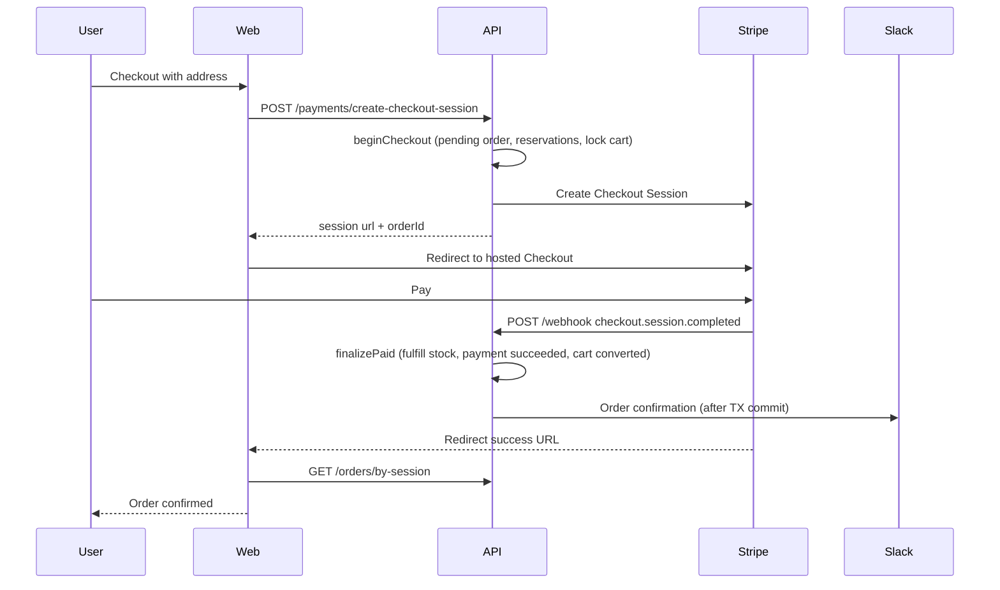

# Checkout flow

Two-phase checkout: reserve stock and create a pending order **before** Stripe payment, then finalize only after a verified webhook.

## Happy path



## Phase 1 — `beginCheckout`

Owned by `CheckoutService.beginCheckout`:

1. Lock cart and variants.
2. Create `orders` row with status `pending` + order items + shipping snapshot.
3. Create pending `payments` row.
4. Create `inventory_reservations` (`reservedStock++`, TTL).
5. Set cart status to `checkout_in_progress`.
6. `PaymentsService` creates Stripe session with metadata `{ orderId, userId, cartId }`.

## Phase 2 — `finalizePaid`

Triggered by Stripe webhook (`WebhooksService` → `CheckoutService.finalizePaid`):

1. Verify signature; record event id for idempotency (`webhook_events`).
2. Lock order (no joins with `FOR UPDATE`).
3. Fulfill reservations (convert reserved stock to sold).
4. Mark payment `succeeded`; order → `processing`.
5. Convert cart (`converted`).
6. After commit: Slack Block Kit order confirmation (failures logged only).

## Order status lifecycle

```
pending → processing → shipped → delivered
                ↘ cancelled / refunded (per admin rules)
```

Admin may advance status via `PATCH /orders/admin/:id/status` with allowed transitions only.

## Failure paths

| Case | Behavior |
|------|----------|
| User cancels Stripe / returns cancel URL | `POST /orders/:id/cancel-checkout` releases reservations, cancels pending order, reopens cart |
| Reservation TTL expires | Expiry sweeper releases stock and cancels stale pending checkouts |
| Webhook retry | Same Stripe event id is ignored after first successful processing |
| Stripe session create fails | Pending checkout is cancelled immediately |
| Slack down | Checkout still succeeds; error logged |

## Cart states involved

| Status | Meaning |
|--------|---------|
| `active` | Shoppable cart |
| `checkout_in_progress` | Locked during pending payment |
| `converted` | Paid order created |
| `expired` | Abandoned / timed out |
