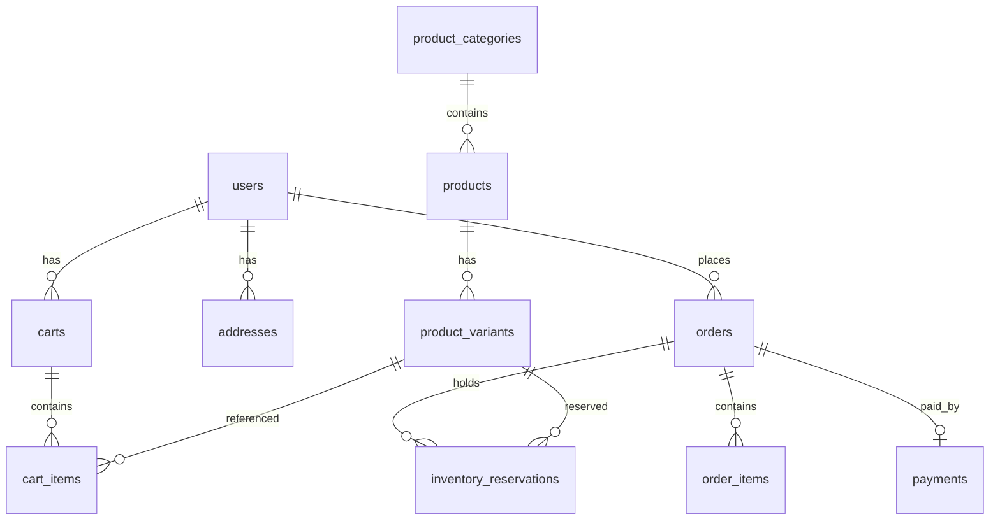

# Database overview

Schema is defined by TypeORM entities under `apps/api/src/**/*.entity.ts`. Enums and shared shapes also live in `@repo/contracts`.

## Tables

| Table | Purpose |
|-------|---------|
| `users` | Accounts, roles, refresh token hash, avatar |
| `product_categories` | Category catalog |
| `products` | Product shell (name, slug, publication status) |
| `product_variants` | SKU, price, media, `stockOnHand`, `reservedStock` |
| `carts` | Per-user cart + status / pending checkout refs |
| `cart_items` | Variant lines in a cart |
| `addresses` | Shipping (and billing) addresses |
| `orders` | Order header, snapshots, Stripe session ids |
| `order_items` | Line items + product snapshot JSON |
| `payments` | Stripe payment attempt per order |
| `inventory_reservations` | Checkout holds on variant stock |
| `webhook_events` | Processed Stripe event ids (idempotency) |

## Relationships

- **Variant stock:** available ≈ `stockOnHand - reservedStock` during checkout.
- **Order snapshots:** `shippingAddress` and each item’s `productSnapshot` are frozen JSON so historical orders stay readable if catalog changes.
- **Cart ↔ order:** cart may store `pendingCheckoutOrderId` / `convertedOrderId`.

## Key enums (contracts-aligned)

| Enum | Values |
|------|--------|
| `UserRole` | `admin`, `user` |
| `AccountStatus` | `active`, `inactive`, `blocked` |
| `PublicationStatus` | `draft`, `published`, `archived` |
| `VariantStatus` | `active`, `inactive`, `archived` |
| `CartStatus` | `active`, `checkout_in_progress`, `converted`, `expired` |
| `OrderStatus` | `pending`, `processing`, `shipped`, `delivered`, `cancelled`, `refunded` |
| `PaymentStatus` | `pending`, `succeeded`, `failed`, `cancelled`, `refunded` |
| `ReservationStatus` | `active`, `expired`, `released`, `fulfilled` |

## Schema management

Entities drive the schema today. Formal migrations are not part of the documented workflow yet — treat entity changes carefully against local Postgres.
